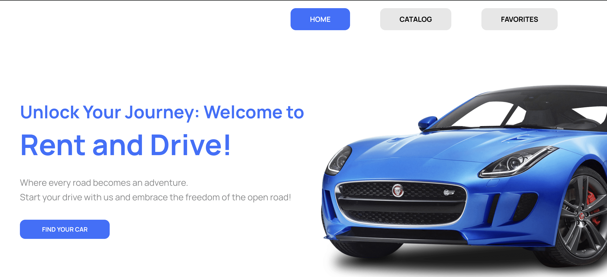

# "Rent and Drive" - Car rental service application

## About the project:

This rental service application is written in JS in combination with React JS
and allows users to browse a catalog of available cars, save preferred vehicles,
and apply filters for a more personalized search experience. Designed to provide
convenience, the app puts the control in the hands of users, enabling them to
easily find and select the ideal car for their needs.

## Demo

You can access the live demo of the application
[here](https://annmatsarska.github.io/car-rent/)

## Technologies used in the project

`JavaScript` `React` `ReduxToolkit` `ReduxPersist` `Axios` `HTML/CSS`
`MockAPI for data` `Styled-components`

## Features

- View a catalog of cars available for rent.
- Filter cars by make, rental price, and mileage.
- Add cars to your favorites.
- View detailed information about each car.
- Contact the rental company via phone.

_Start your drive with us and embrace the freedom of the open road!_
